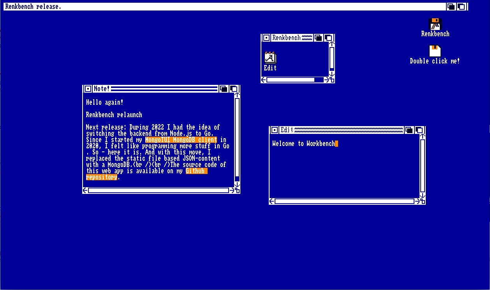

# Renkbench

A Javascript Amiga Workbench 1.3.3 look and feel clone.

## Goal
For getting some Javascript practice, in the year 2009 I created an [Amiga Workbench](https://en.wikipedia.org/wiki/Workbench_(AmigaOS)#Workbench_1.x) clone and hosted it on [Lachsfilet.de](http://www.lachsfilet.de/).
Since not all look and feel features of the orginal Workbench were implemented, in December of 2018 I started to refactor the code and added some missing features.

In the meantime I put the whole page into a [Docker](https://www.docker.com/) container to simplify the deployment process.

## Frontend features
Currently, the Workbench clone contains the following features:

* Drag and drop functionality for icons and windows
* Topaz style font
* Original window behavior with resizing and scrolling
* Window to the front and to the back buttons
* Closing of windows
* Directories displayed as drawers
* Context menu in the main title bar triggered by mouse right click
* Touch events for handheld usage
* Customized keyboard input using Topaz font

## To-do
* Bugfixing
* Content
* Introduce applications
* Further refactoring
* Continue splitting frontend code into multiple files

## Backend
In 2022, I switched the whole backend to [Go](https://go.dev/) and replaced the single JSON-file for the content with a [Mongo](https://www.mongodb.com/) DB instance.

For content seeding (windows, menu, etc.) I wrote an own Go application called init.

## Docker
The system is setup with [Docker Compose](https://docs.docker.com/compose/), consisting of two containers:

* The renkbench app (Go and JavaScript ES6)
* The MongoDb instance

Putting the application into a Docker image enhanced the delivery process and brought the advantage to run it locally without setting up a Mongo DB instance and the Node.js stuff for the JacaScript unit tests. For CI build and release I added the Azure DevOps pipelines as YAML code. I will replace them with GitHub Actions, which are also stored in the current repository.

## JavaScript unit tests
I started with unit testing using [Jasmine](https://github.com/jasmine/jasmine) and [jsdom](https://github.com/jsdom/jsdom), after I cut the createNode builder out of the monolith.
